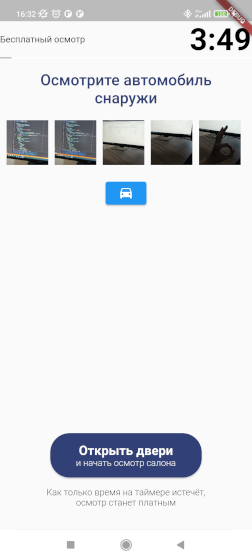

# Cars7 part of an app front-end request

(A very small portion of it, wihich i replicated as a part of my probation period at Cars7)

## App functionality overwiev
- Main page (of the app described as my assigment)                                    

> The point of interest here is the button with the green text and a camera icon of the same color.
> Once user taps it, they are transfered to the camera where they can take pictures.

- Camera                                                            

> There it is! The camera! 
>> The photos are taken by tapping that round grey button at the bottom 

- Camera, but fancier

> Upon taking some photos, the **scrollable gallery bar** appears! 
>> Take more photos than your device's screen can fit and photo thumbnails will go out of bounds.
>> Which is quite handy, including that you can scroll **gallery bar** on the x axis.
Also you can see blue button next to the grey one. This button submits photos user have taken. More about it: literally on the next line.
- Photos submit screen
> After tapping on the blue botton with the "ГОТОВО" on it, user will be navigated to this page. Also user cant tap it until there is at least one element in the **gallery bar**.

> Here you can see familiar **gallery bar**, which is so familiar because it is quite literally been pasted here from the previous screen.
> So it operates just the same.
>> Altough a blue button right bellow **gallery bar** upon clicking it will navigate user to the *camera* so they can add more photos to the collection.

That's pretty much it about functionality

## Please note
This app is far from what it intended to be. 
It would be a joy if this code helps somebody, altough theres is just CameraController which is working as intended. And my be some styles! 

## README inside of a readme
If you here for the **Timer**, i suggest you search for other solution, because this timer **DOES NOT** keep it's *state* between pages.
and I dont have time nor knowledge to fix it. Also i would appretiate anything that smells like a solution to this matter.

Other than that, timer countdow is the solid piece and working as it supposed to. 
